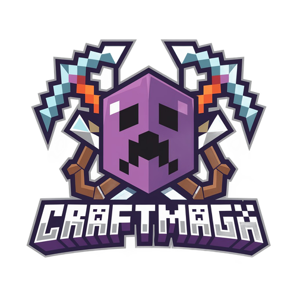

# CraftMaga - Next.js Website



Oficiální webové stránky českého Minecraft serveru **CraftMaga** postavené na Next.js 14.

## 🚀 Rychlý start

### Požadavky
- Node.js 18+ 
- npm nebo yarn

### Instalace a spuštění

```bash
# Instalace závislostí
npm install

# Spuštění vývojového serveru
npm run dev

# Build pro produkci
npm run build

# Spuštění produkční verze
npm run start
```

Otevřete [http://localhost:3000](http://localhost:3000) ve vašem prohlížeči.

## 🏗️ Technologie

- **Next.js 14** - React framework s App Routerem
- **TypeScript** - Type safety
- **Tailwind CSS** - Utility-first CSS framework
- **Shadcn/ui** - UI komponenty
- **Lucide React** - Ikony
- **TanStack Query** - Data fetching
- **next/font** - Font optimalizace

## 📁 Struktura projektu

```
├── app/                    # Next.js App Router
│   ├── api/               # API Routes
│   │   ├── czech-craft/   # Czech-Craft API proxy
│   │   ├── craftlist/     # Craftlist API proxy  
│   │   ├── minecraftlist/ # MinecraftServery API proxy
│   │   └── minecraft-list/# Minecraft-list API proxy
│   ├── kontakt/           # Kontakt stránka
│   ├── pravidla/          # Pravidla stránka
│   ├── napoveda/          # Nápověda stránka
│   ├── layout.tsx         # Root layout
│   ├── page.tsx           # Hlavní stránka
│   ├── globals.css        # Globální styly
│   └── not-found.tsx      # 404 stránka
├── components/            # React komponenty
│   ├── ui/               # UI komponenty (shadcn/ui)
│   ├── Navigation.tsx    # Navigace
│   ├── HeroSection.tsx   # Hero sekce
│   ├── VotingSection.tsx # Hlasování
│   └── ...
├── hooks/                 # Custom React hooks
├── lib/                   # Utility funkce
├── public/               # Statické soubory
│   └── assets/          # Obrázky a ikony
└── next.config.js        # Next.js konfigurace
```

## 🌐 API Routes

Next.js API routes nahrazují původní Express server:

- `/api/czech-craft/[slug]` - Czech-Craft hlasování API
- `/api/craftlist/[token]` - Craftlist hlasování API  
- `/api/minecraftlist/[token]` - MinecraftServery hlasování API
- `/api/minecraft-list/[slug]` - Minecraft-list hlasování API

## 📱 Funkce

- ⚡ **Server rychlostí** - Real-time zobrazení online hráčů
- 🗳️ **Hlasování systém** - Integrace s hlavními Czech serverlists
- 🗺️ **Dynmap integrace** - Živá mapa serveru
- 🛒 **VIP obchod** - Tebex integrace
- 📱 **Responzivní design** - Optimalizováno pro všechna zařízení
- 🎨 **Glassmorphism UI** - Moderní design s glass efekty

## 🚀 Nasazení na Vercel

Projekt je připravený pro nasazení na Vercel:

1. Pushněte kód do Git repozitáře
2. Připojte repozitář k Vercelu
3. Vercel automaticky detekuje Next.js a nakonfiguruje build

Alternativně použijte Vercel CLI:
```bash
npx vercel --prod
```

## 📊 SEO Optimalizace

- Metadata pro všechny stránky
- Structured data (JSON-LD)
- Optimalizované obrázky s next/image
- Canonical URLs
- Sitemap a robots.txt

## 🔧 Konfigurace

### Environment Variables

Vytvořte `.env.local` soubor:

```env
# Přidejte jakékoliv potřebné API klíče nebo konfiguraci
NEXT_PUBLIC_SITE_URL=https://craftmaga.cz
```

### Fonts

Použity Google Fonts přes next/font pro optimální loading:
- Poppins (300, 400, 500, 600, 700, 800, 900)

## 🤝 Jak přispět

1. Forkněte repozitář
2. Vytvořte feature branch (`git checkout -b feature/amazing-feature`)
3. Commitněte změny (`git commit -m 'Add amazing feature'`)
4. Pushněte do branch (`git push origin feature/amazing-feature`)
5. Otevřete Pull Request

## 📞 Kontakt

* **IP adresa:** `play.craftmaga.cz`
* **Discord:** [Připojte se k nám na Discordu!](https://discord.gg/eTuYxy7Ry9)
* **Web:** [craftmaga.cz](https://craftmaga.cz)

Těšíme se na vás!

---

**© 2024 CraftMaga** - Vytvořeno s ❤️ týmem CraftMaga
